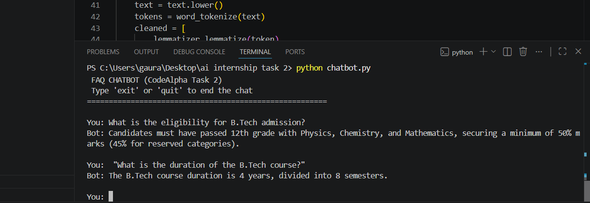

# 🎓 College Admission FAQ Chatbot

> An NLP-powered chatbot that instantly answers common college admission queries using TF-IDF and Cosine Similarity.

**🔖 CodeAlpha Internship — Task 2**

---

## 📌 Overview

This is a command-line chatbot built to answer frequently asked questions related to **B.Tech college admissions** — covering eligibility, fees, hostel facilities, scholarships, placements, and more.

Instead of hardcoding exact question matches, the bot uses **Natural Language Processing (NLP)** techniques to understand the *meaning* of a user's question and find the most relevant FAQ — even if the wording is different.

---

## 🛠️ Tech Stack

| Technology | Purpose |
|---|---|
| **Python** | Core programming language |
| **NLTK** | Text preprocessing (tokenization, stopword removal, lemmatization) |
| **scikit-learn** | TF-IDF vectorization & Cosine Similarity matching |

---

## ⚙️ How It Works

The chatbot follows a simple NLP pipeline:

1. **Load FAQs** — Question-answer pairs are loaded from `faqs.json`
2. **Preprocess Text** — Each question is lowercased, tokenized, stripped of punctuation/stopwords, and lemmatized
3. **Vectorize** — All FAQ questions are converted into numeric TF-IDF vectors
4. **Match User Query** — The user's question goes through the same preprocessing, then gets compared using **Cosine Similarity**
5. **Return Best Answer** — The FAQ with the highest similarity score is returned (if it crosses a confidence threshold)

---

## 🚀 How to Run

**1. Install dependencies**
```bash
pip install nltk scikit-learn
```

**2. Run the chatbot**
```bash
python chatbot.py
```

> 🔄 On first run, NLTK will automatically download required data (`punkt`, `stopwords`, `wordnet`). This is normal and only happens once.

---
---

## 📸 Screenshots


